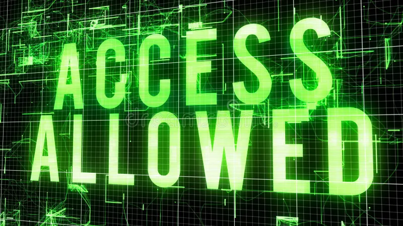

# parents_access
we made this project as a simple example to improve internet safety for children

<picture>
  
</picture>

## main idea
If a *child* would like access to social media, he must get his/her mother's or father's *face ID* in order to access it. As awareness for the parent to know that their child is using social media.

## How it operates
If the child tries to access social media without the parent's face ID, access will be denied. In this project, we presented that action in the movement of the servomotor, when access is denied, the servo would move to the left, followed by a turn to the right in a form of a "no".

<picture>
  
</picture>

If the child has his or her parents' approval, the program will give them access to social media. In this specific project, the servo will move up and then down in the form of a "yes".

<picture>
  
</picture>

If the program didn't identify the user, it would make a buzzer sound and deny access for the user.
